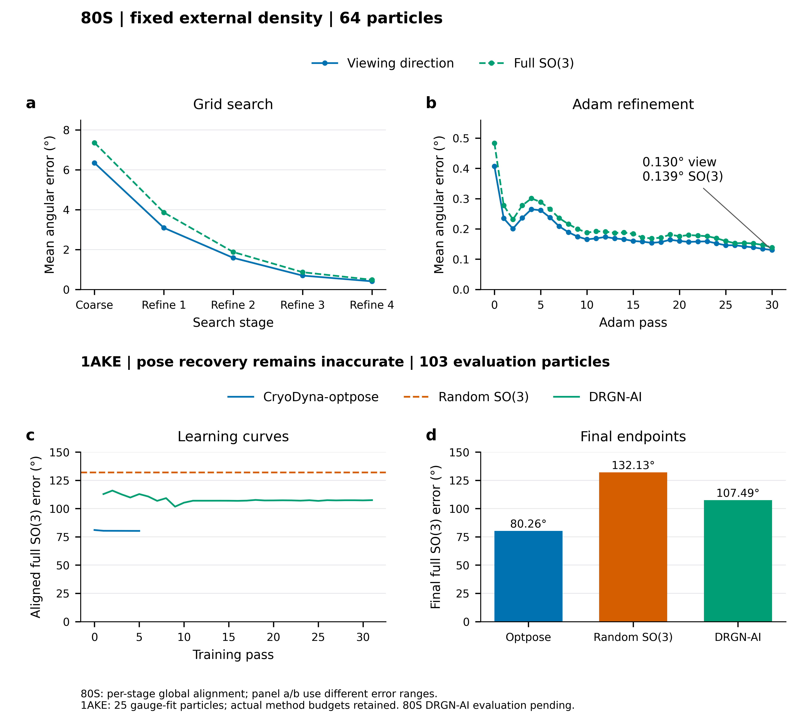
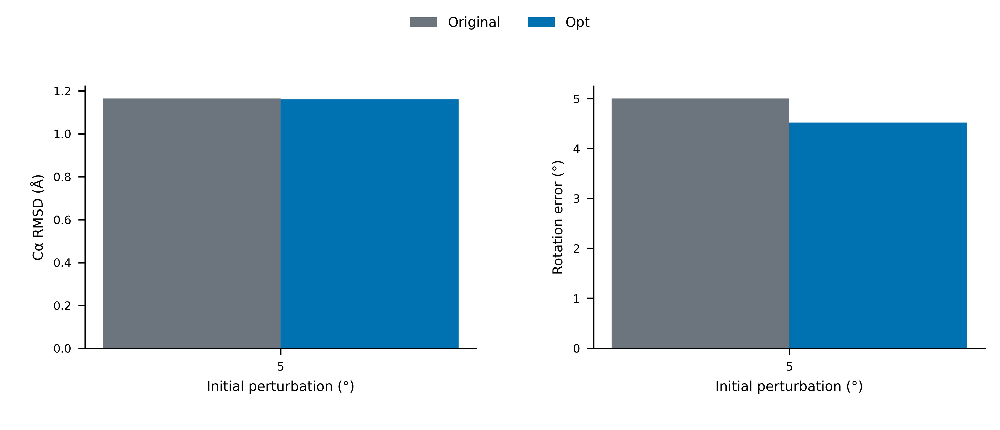
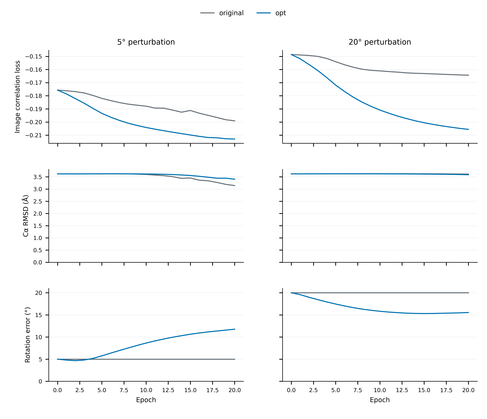
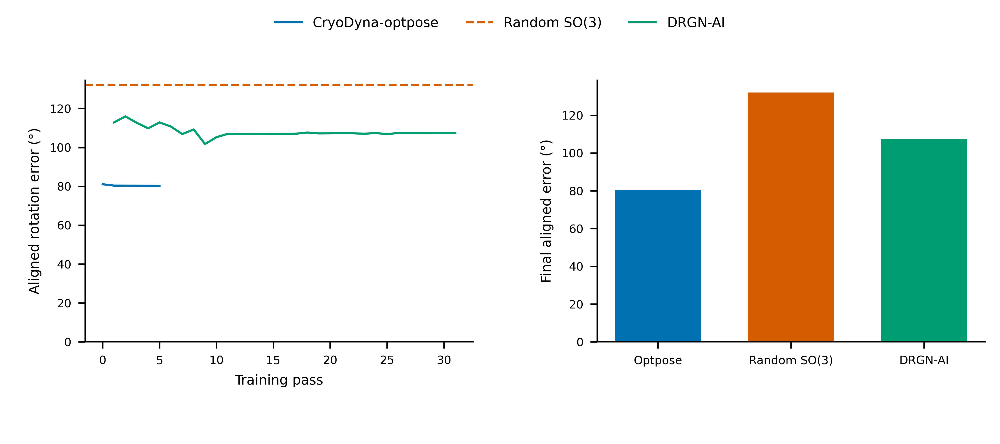
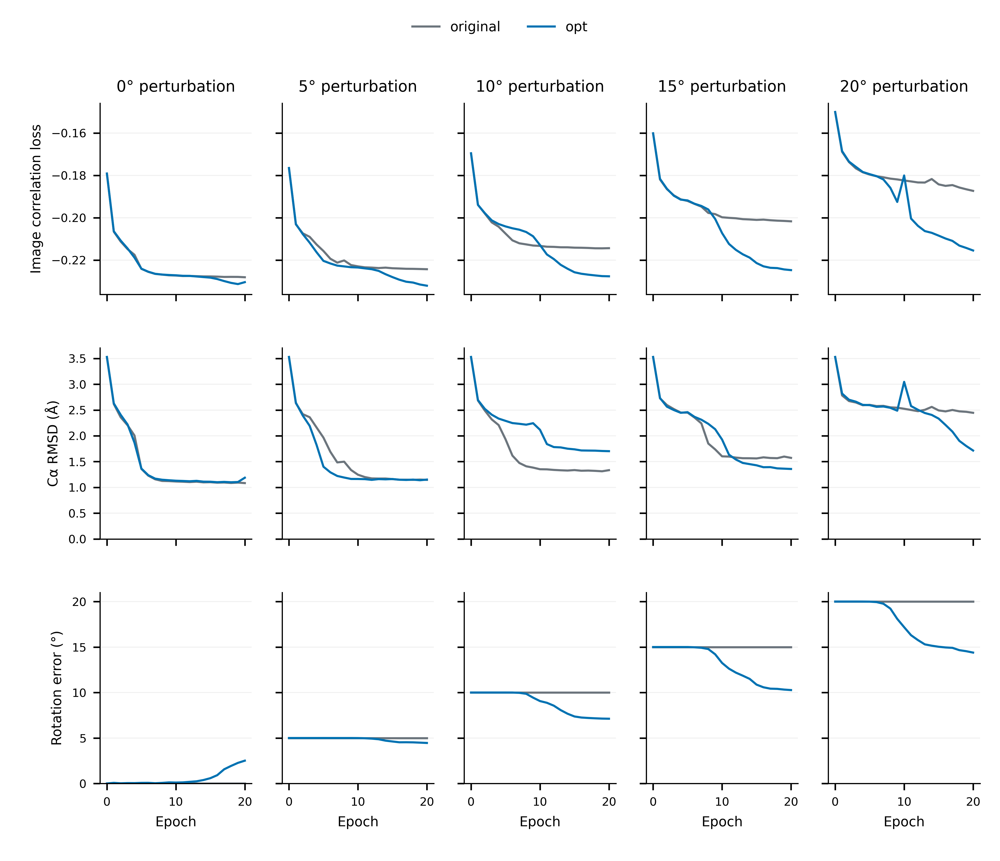
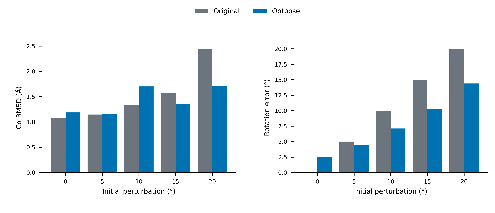

# CryoDyna-optpose 提交前验收记录

记录日期：2026-09-30。提交定位：**初版开发提交，完整扰动训练和证据图已保存；科学验收仍有待完成项目**。

[合图源数据与说明](optpose_evidence/release_summary/caption.md)。80S 为固定外部密度先验的 pose-only control；1AKE 为参考结构 Optpose、学习密度 DRGN-AI 与随机旋转对照。

## 接口与复现

入口：`scripts/benchmark_optpose.py`。完整命令见 [使用说明](optpose.md)。

| 操作 | 输入 | 输出 |
| --- | --- | --- |
| `run` | original/opt、配置、角度数组，默认 0/5/10/15/20 | 每轮状态、逐粒子预测、三行学习曲线 |
| `evaluate` | 单个新式或历史 Output dir | loss、Cα RMSD、完整 SO(3) 角度误差合图 |
| `compare` | 多个 `简称=Output目录` | RMSD 与角度误差柱状图 |
| `abinit` | 图像、CTF、参考结构 | HPS 初始化与 pose/结构联合学习 |
| `compare-abinit` | optpose 输出、DRGN-AI 输出 | optpose、DRGN-AI、均匀随机旋转对照图 |
| `acceptance` | 匹配的 original/opt 实验矩阵 | 逐粒子复算与发布门槛检查 |

训练输入、随机种子、粒子对应关系、配置和源码指纹随实验保存。每轮保留 latent、预测旋转、decoder 和指标；续跑文件另存优化器与随机状态。图像输出 PNG、PDF、SVG，随附 CSV。

## 软件验证

26项测试通过。本次完整测试覆盖 SO(3)、Kabsch RMSD、HPS 对照、pose 梯度、输入隔离、
训练中断恢复、decoder 指标复算、固定密度的 Fourier 切片与梯度、初始模型数值一致性。
执行记录：[release_tests.log](optpose_evidence/release_tests.log)。

## 历史 checkpoint 独立重算

条件：5°、20 轮、50,000 粒子；固定 40,000 个评估粒子报告指标。opt 为大 MLP pose head，正则权重 0.5。

| 方法 | Cα RMSD (Å) | SO(3) 误差 (°) |
| --- | ---: | ---: |
| Original | 1.164842 | 5.000000 |
| Opt | 1.160435 | 4.516761 |

这组历史 checkpoint 的两项指标均改善。当前版本的完整训练复现另行记录。

来源：[汇总 CSV](optpose_evidence/historical_5deg/comparison.csv)。原始 checkpoint 位于 `/media/nyh/Elements/Cryodyna/matrix_shared_init_20260914/`。导入记录位于 `results/optpose/legacy_original_5/imported/manifest.json` 与 `results/optpose/legacy_big_l2_5/imported/manifest.json`。

## Pose table 开发试验

1024 粒子、20 轮、5°/20°、仅旋转、初版无正则 pose table。5° 出现角度漂移；20° 两项指标改善。当前完整复现实验采用大 MLP。

[逐轮数据](optpose_evidence/table_pilot/learning_curves.csv)。

## 无初始 pose 对照

128 粒子开发试验：25 个校准粒子拟合单个全局坐标变换和整体手性，另 103 个粒子报告指标。Optpose 使用参考结构与 HPS，训练 5 轮；DRGN-AI 来自 50,000 粒子、31 个遍历的既有实验，并重算相同子集。随机对照采用固定种子的 Haar-uniform SO(3) 旋转。先验和预算差异随图表保留。

| 方法 | 平均角度误差 (°) | 90 分位 (°) |
| --- | ---: | ---: |
| Optpose | 80.257181 | 165.018347 |
| DRGN-AI | 107.486008 | 170.871874 |
| Random SO(3) | 132.128213 | 174.885026 |

相对两个对照的误差更低。准确恢复目标为平均 ≤5°、90 分位 ≤10°，当前结果距离目标较大。发布还要求完整 50,000 粒子实验。

来源：[逐轮数据](optpose_evidence/abinit_pilot/abinit_metrics.csv)、[自动验收](optpose_evidence/abinit_pilot/abinit_acceptance.json)。

8 粒子诊断中，Cα 无噪声闭环误差约 0.485°；真实全原子构象作为诊断模板时，真实图像误差为 32.887°。真实构象仅用于诊断，结论范围限定为所测条件。数据作者说明图像由 EMAN2 密度图投影并加入 CTF 和 Gaussian 噪声，见[数据生成说明](https://byte-research.gitbook.io/cryostar/a-minimal-case)。诊断原始 JSON 随本报告保存在 `optpose_evidence/diagnostics_*.json`。

## 完整扰动结果：50,000 粒子 × 20 轮

实验目录：`/media/nyh/Elements/Cryodyna/optpose_release_20260928/`。
训练使用 50,000 粒子，固定 40,000 个粒子报告指标，seed=1，批次64，参考结构初始化128步。
每种方法的每档扰动均已完成20轮，保留全部逐轮预测与decoder状态。
十组终点逐粒子pose与decoder结构复算均通过，见[复算记录](optpose_evidence/full_1ake/endpoint_replay.json)
及[自动验收](optpose_evidence/full_1ake/acceptance.json)。本次核验范围为终点，完整逐轮回放由默认 `acceptance` 命令提供。

| 扰动 | Original RMSD (Å) | Opt RMSD (Å) | Original SO(3) (°) | Opt SO(3) (°) | 两项门槛 |
| --- | ---: | ---: | ---: | ---: | --- |
| 0° | 1.083025 | 1.187318 | 0.004078 | 2.511655 | 待改进 |
| 5° | 1.145531 | 1.151190 | 5.000000 | 4.457048 | RMSD 待改进 |
| 10° | 1.333641 | 1.701989 | 10.000000 | 7.121823 | RMSD 待改进 |
| 15° | 1.572150 | 1.356881 | 15.000000 | 10.270291 | 达到 |
| 20° | 2.445782 | 1.714370 | 20.000000 | 14.389820 | 达到 |

[逐轮CSV](optpose_evidence/full_1ake/learning_curves.csv)；[终点CSV](optpose_evidence/full_1ake/comparison.csv)。
原收尾检查要求初始化哈希完全相同，因浮点数值差异中止汇总。
本次逐项比较全部结构模型张量与未注册 attention 层：最大绝对差异
`6.556510925292969e-7`，在 `atol=1e-6, rtol=1e-6` 范围内；整数元数据保持精确相同。
精确哈希仍保留在原 manifest 中，数值核验记录见
[initialization_verification.json](optpose_evidence/full_1ake/initialization_verification.json)。
初始结构一致性的定义现明确为上述数值容差。

## 80S 固定密度对照

完整100,000粒子、固定CryoAI 80S密度、seed=0、HPS+30次Adam，每个粒子全部纳入评估：

| 阶段 | 视线方向误差 (°) | 完整 SO(3) 误差 (°) |
| --- | ---: | ---: |
| 最后一次网格搜索 | 0.492777 | 0.566096 |
| Adam 30 | 0.144339 | 0.153260 |

[完整逐轮数据](optpose_evidence/80s_full_control/metrics.csv)；
[输入文件、检查点与方法记录](optpose_evidence/80s_full_control/provenance.json)。
输入为已准备的图像、CTF、固定外部密度；初始pose由网格搜索获得。
64粒子完整搜索细分曲线的终点为视线0.130269°、SO(3)0.138650°，见本页合图。
两种粒子数分别记录；指标以每轮一个全局坐标/手性拟合后的全粒子均值计算。

DRGN-AI 80S六种子复现实验仍由现有任务运行；本提交快照处于seed0首个HPS轮次。
其80S角度误差与严格文献复现结论待完整训练和协议核验。
固定外部密度提供的结构先验随结果显式保留。
详见[80S复现记录](80S_REPRODUCTION.md)。

## 尚待达到的科学门槛

1. 0°时角度保持≤0.05°；5°、10°时RMSD改善，所有正扰动同时改善两项指标。
2. 1AKE无初始pose的完整实验达到平均≤5°、P90≤10°，并完成匹配对照。
3. 80S DRGN-AI六次实测曲线与论文协议逐项核验；三方法图随真实结果补齐。

本次提交交付脚本、测试、实测结果和这些验收记录，版本定位为可复现的开发初版。
